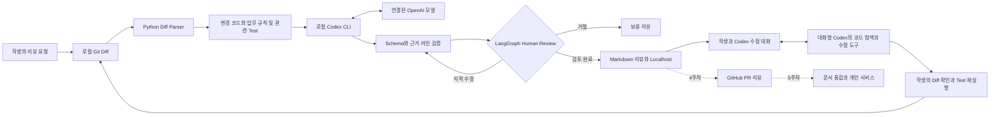

# 코드 리뷰 Agent 아키텍처

코드 리뷰 Agent는 요청과 변경 코드를 읽고, 업무 규칙·관련 테스트를 근거로 문제 후보를 제안한다. Python은 파일 범위, 결과 형식, 변경 라인, 테스트 종료 코드를 검증한다. 사람은 제안의 타당성과 수정 범위를 판단한다.

원본 Mermaid: `assets/components/day3/master-code-review-agent.mmd`. PPT에는 같은 구조를 편집 가능한 노드·연결선으로 포함하고, 복잡한 흐름은 실행 요청·리뷰 검증·개선 반복의 세 부분으로 나누어 설명한다.

## 구성 요소별 Role

| 구성 | 담당 동작 | 사람이 확인할 것 |
|---|---|---|
| Codex 대화 | 작업 분석, 코드 탐색, 구현·수정 제안 | 요청 범위와 수정 Diff |
| Codex CLI Adapter | Python에서 로컬 CLI 실행, 응답 수신 | 실제 Provider와 오류 원인 |
| OpenAI 모델 | 업무 맥락을 읽고 문제 후보 판단 | 근거·재현 조건·과잉 지적 |
| Python | 허용 파일, 입력·응답 검증, Test 실행 | 실제 계산 결과와 종료 코드 |
| LangGraph | 검토 대기, 결정 수신, 재개 경로 | 같은 실행에서 선택한 결정 |
| Human Review | 수용·수정·제외와 수정 범위 판단 | 변경 이후 재실행 결과 |

## 로컬 실행과 모델 위치

두 실행 방식을 구별한다. **수업용 리뷰 Adapter는 전달한 Context만 검토**한다. shell·웹 탐색·개인 MCP 설정을 끄고 구조화된 후보를 받으므로, Adapter 자체가 추가 도구를 자율적으로 선택한다고 설명하지 않는다. **학생이 직접 사용하는 대화형 Codex는 Coding Agent**로서 요청 범위 안에서 코드를 읽고 수정하며 Test를 실행한다. 전체 서비스는 이 판단과 고정된 Python/LangGraph 검증을 연결한 시스템이다.

Codex CLI는 학생 PC에서 실행한다. `codex login`으로 계정을 연결하고 `codex login status`로 인증 상태를 확인한다. 로그인된 Codex는 연결된 서비스의 모델을 사용하므로 인터넷과 계정의 Codex 이용 권한·한도가 필요하다. 로컬 LLM을 설치해 추론하는 방식과는 다르다.

수업의 모델 실행 경로는 Codex CLI다. 로그인이나 네트워크 문제가 생겼을 때만 준비된 Fixture 응답을 명시적으로 재생한다. Fixture 결과를 실제 Codex의 응답으로 표시하지 않는다.

참고: [Codex 인증](https://learn.chatgpt.com/docs/auth), [Codex 비대화형 실행](https://learn.chatgpt.com/docs/developer-commands#codex-exec).
