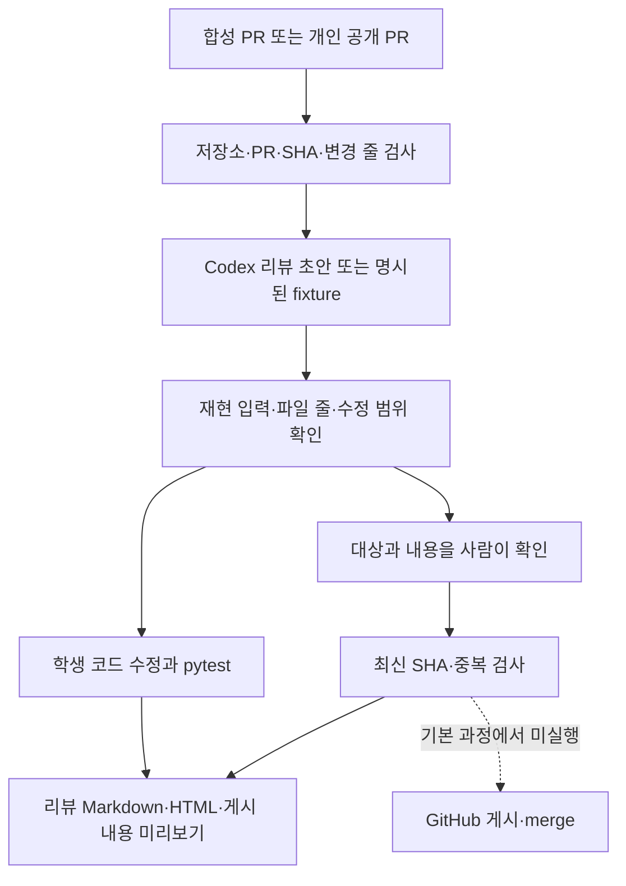
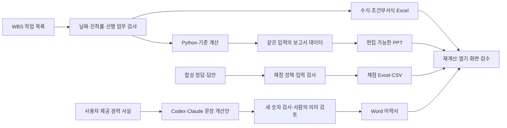

# 4주차 실습 아키텍처

JSON은 최종 결과가 아니라 프로그램 사이의 입력입니다. 학생은 실제 기능 코드를 수정하고 테스트를 실행한 뒤, 편집 가능한 파일과 브라우저 화면을 확인합니다.

현재 코드는 원격 리뷰 게시를 수행하지 않습니다. 공개 PR 읽기는 `gh`의 GET만 사용하며 별도 선택입니다. 실제 리뷰·게시 서비스로 확장할 때는 승인 인증·만료, 게시 직전 재조회, 동시 요청 제어, 불확실 응답 뒤 이력 확인이 추가로 필요합니다.

| 구현 영역 | 파일 | 학생의 실제 변경 |
|---|---|---|
| PR 검증·미리보기 | `labs/day4/pr_review_lab/service.py` | 대상 확인·오류·테스트 |
| 결제 기능 | Notebook이 만든 `checkout.py` | 입력 검사·0원 하한 |
| Excel | `labs/day4/office_lab/sheets/student_excel.py` | 날짜·진척률·답안·정답 |
| Google Sheets | `labs/day4/office_lab/google_sheets/Code.gs` | 개인 연습 시트의 수식·서식 |
| Word | `labs/day4/office_lab/documents/resume_lab.py` | 경력 문장·스타일·사실 검사 |
| PPT | `labs/day4/office_lab/presentations/student_ppt.mjs` | 같은 데이터의 보고 구조·레이아웃 |

Google Sheets 예제는 새 합성 시트만 만드는 선택 확장입니다. 원본 성적표는 읽거나 수정하지 않았으며, 실제 Google 계정에서의 스크립트 실행은 별도 확인이 필요합니다.
